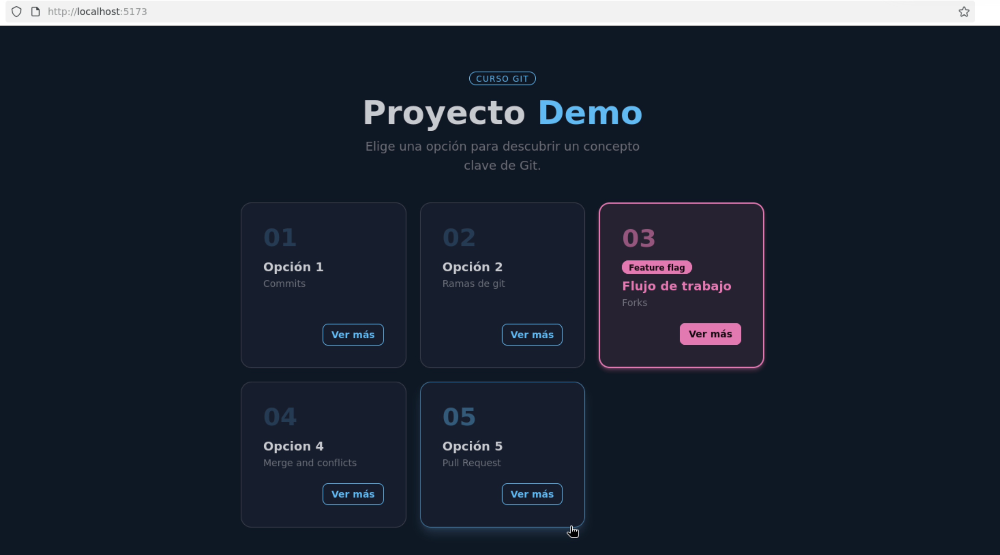
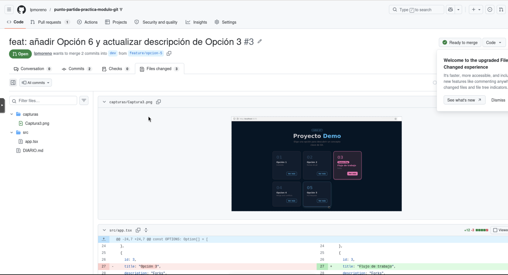
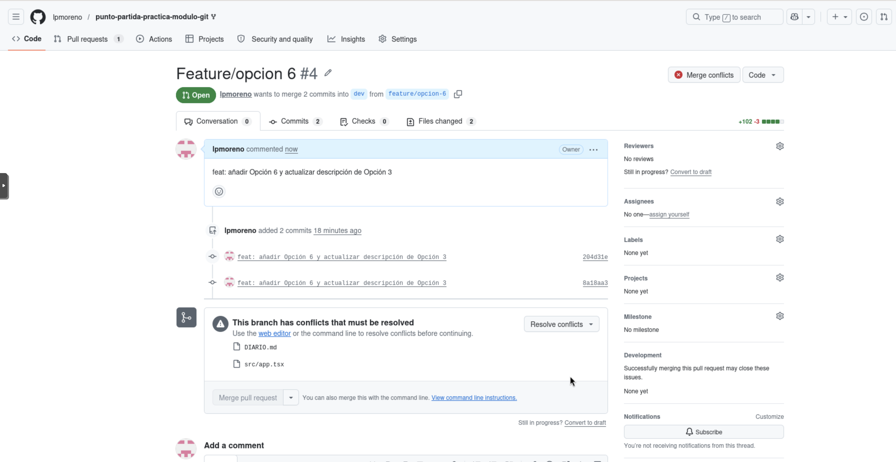
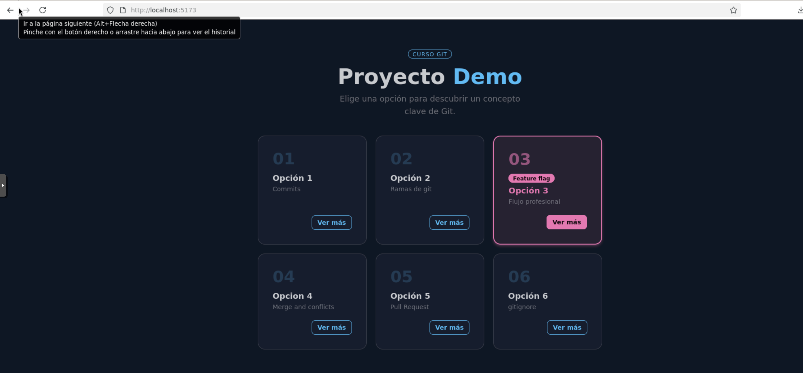

# Laboratorio - Flujo Git colaborativo
## Author: Laura Paneque Moreno

## Tarea 1 - Fork y configuración inicial

1. En primer lugar realizo un fork del repositorio del instructor en mi cuenta de GitHub.
2. Clono el fork en mi ordenador utilizando el comando

```
git clone https://github.com/lpmoreno/punto-partida-practica-modulo-git.git
```
3. Instalo las dependencias y arranco la app para confirmar que funciona.

```
npm i
nmp run dev
```

4. Añado el repositorio del instructor como remote con el nombre `upstream` con el siguiente comando:

```
git remote add upstream https://github.com/Lemoncode/punto-partida-practica-modulo-git.git
```
 
5. Verifico con `git remote -v` que tengo tanto `origin` (tu fork) como `upstream` (el instructor).
```
git remote -v
```

6. Creo la rama `dev` a partir de main y la subo a mi fork.

```
git switch -c dev
git push -u origin dev
```

Un fork o bifurcación es la creación de una copia independiente a partir de un proyecto de software para desarrollar por caminos separados. Permite modificar el código sin afectar el proyecto original.

Upstream hace referencia al repositorio original desde el que se ha clonado (forked) un proyecto. Nos permite mantener nuestra copia actualizada con los cambios de otros desarrolladores. Además, podemos solicitar la integración de nuestros cambios en el repositorio original.


<<<<<<< HEAD
<<<<<<< Updated upstream

=======
=======
>>>>>>> origin/dev


## Tarea 2 — Feature branch A: añadir la Opción 5

1. Creo la rama `feature/opcion-5` a partir de `dev`.

En primer lugar nos aseguramos de estar en la rama dev con git branch o git status y creamos la rama:
```
git switch -c feature/opcion-5
```

2. Edito `src/app.tsx` para incluir la tarjeta 5 al array `OPTIONS`:

```tsx
```

3. Además, modifico el campo `description` de la **Opción 3** de su valor actual a:

```tsx
description: "Flujo de trabajo",
```

4. Arrancamos la app y verificamos en el navegador que aparece la Opción 5.
```
npm run dev
```

5. Hacemos un commit con el mensaje: `feat: añadir Opción 5 y actualizar descripción de Opción 3`
```
git add .
git commit -m "feat: añadir Opción 5 y actualizar descripción de Opción 3"
```

6. Sube la rama a tu fork.
```
git push -u origin feature/opcion-5
```

La rama parte de dev porque en este proyecto el desarrollo se está realizando sobre la rama dev. La rama main es la rama estable y los cambios en ella se realizarán de forma muy controlada para evitar pérdidas de datos.



---

### Tarea 3 — Feature branch B: añadir la Opción 6 (aquí está el conflicto)

**Importante:** crea esta rama **ahora**, antes de mergear la Tarea 2. Ambas ramas deben partir del mismo punto en `dev`.

1. Vuelvo a `dev` y creo la rama `feature/opcion-6` desde ahí.

```
git switch dev
git switch -c feature/opcion-6
```

2. Edito `src/app.tsx` y añade la siguiente tarjeta al array `OPTIONS`:

```tsx
{
  id: 6,
  title: "Opción 6",
  description: "gitignore",
  message:
    "El fichero .gitignore le dice a Git qué ficheros debe ignorar. Úsalo para excluir ficheros de entorno (.env), dependencias (node_modules) y cualquier cosa que no deba estar en el repositorio.",
  featureFlag: false,
},
```

3. Además, cambio el campo `description` de la **Opción 3** a:

```tsx
description: "Flujo profesional",
```

4. Hago un commit con el mensaje: `feat: añadir Opción 6 y actualizar descripción de Opción 3`
```
git add .
git commit -m "feat: añadir Opción 6 y actualizar descripción de Opción 3"
```
5. Subo la rama a mi fork.
```
git push origin feature/opcion-6
```

Un conflicto se produce cuando dos personas o ramas editan la misma línea de un fichero, impidiendo así que GIT pueda realizar una fusión automática. En este punto es necesaria una intervención manual para mezlar e integrar ambos cambios. 

---

### Tarea 4 — Pull Request 1: Feature A a `dev`

1. Abre una Pull Request en GitHub desde `feature/opcion-5` hacia `dev`.
2. Ponle como título: `feat: añadir Opción 5 y actualizar descripción de Opción 3`
3. Antes de mergear, abre la pestaña **Files changed** y revisa el diff.
4. Mergea el PR.
5. Actualiza tu rama `dev` local con `git pull origin dev`.

En la pestaña Files changed revisamos los cambios realizados entre ambas ramas. Es útil hacerlo antes de mergear para evitar integrar código no deseado y/o evitar la pérdida de código. Adjunta la captura 4.


---

### Tarea 5 — Pull Request 2: Feature B a `dev`, conflicto

1. Abro una Pull Request desde `feature/opcion-6` hacia `dev`.
2. GitHub detectará un conflicto. No podrá mergear automáticamente.
3. Resuelvo el conflicto **en local** siguiendo estos pasos:
   - Me situo en la rama `feature/opcion-6`
   - Descargo `dev` con `git fetch origin dev`
   - Fusiono con `git merge origin/dev`
   - Abro `src/app.tsx` en VS Code y localizo los marcadores de conflicto
   - Me quedo con la versión de  **`"Flujo profesional"`**
   - Guardo el fichero
   - Arranco la app y verifico que se ven todas las opciones correctamente
   - Hago el commit de resolución: `merge: resolver conflicto de descripción en Opción 3`
   - Subo la rama con `git push origin feature/opcion-6`
4. Vuelve al PR en GitHub. El conflicto habrá desaparecido. Mergea el PR.
5. Actualiza tu `dev` local.




Esta captura número 7se me ha pasado hacerla.


Estos marcadores son conflictos de fusión (merge conflicts) en Git, que aparecen cuando intentas unir dos ramas (merge) que modificaron la misma línea de un archivo de maneras distintas. Git no sabe cuál versión conservar y te pide ayuda. 
Los marcadores significan:

<<<<<<< HEAD (Marcador de inicio): Indica el comienzo del conflicto. Todo lo que está debajo hasta el ======= corresponde a los cambios en la rama actual (donde estás parado).

======= (Separador): Línea divisoria que separa tus cambios locales de los cambios que vienen de la otra rama (o rama remota).
    
>>>>>>> [nombre_rama] (Marcador de fin): Indica el final del conflicto. Todo lo que está encima hasta el ======= son los cambios de la rama que intentas fusionar.

---

### Tarea 6 — Limpieza y cierre del diario

1. Borrogit  las dos feature branches en GitHub (botón **Delete branch** o desde la pestaña de ramas).
2. Bórralas también en local:

```bash
git branch -d feature/opcion-5
git branch -d feature/opcion-6
```

3. Ejecuta `git branch` y confirma que solo te quedan `main` y `dev`.
4. Asegúrate de que tu `DIARIO.md` está completo con todas las capturas y haz commit y push.


Hace varios años trabajé en la empresa privada con sistemas controles de versiones, Subversion y después con GIT en sus inicios, aunque la empresa contaba con repositorio propio de GIT y no trabajábamos con Pull Requests. Esta unidad me ha servidor para refrescar conocimiento y para ampliar más sobre esta unidad.
